# Signal Chain — Blues Rig

> Last updated: May 2026  
> Core platform: BOSS IR-200 · Twin Reverb sim · Stereo out

---

## About This Project

This project documents my guitar rig and serves as a personal study library for recording blues guitar. It covers the full signal chain from guitar to GarageBand — hardware settings, macOS driver setup, session workflow, and a structured plan for building recording skills. The goal is to understand the rig completely and capture usable recordings as a weekend musician using only the gear on hand.

---

## Documents

| # | File | Description |
|---|------|-------------|
| 1 | [Rig Settings Reference](RIG_SETTINGS_REFERENCE.md) | Hardware settings, patch save procedures, and pedal configuration for the IR-200, BD-2, RV-6, and AB/Y splitter |
| 2 | [IR-200 & GarageBand Setup](IR200_GARAGEBAND_SETUP.md) | Driver installation, Aggregate Device configuration, and GarageBand setup for macOS Tahoe |
| 3 | [Blues Recording Quick-Start](BLUES_QUICKSTART.md) | Per-session checklist from hardware hookup through export, with GarageBand keyboard shortcuts |
| 4 | [GarageBand Study Plan](GARAGEBAND_STUDY_PLAN.md) | Two-weekend structured learning roadmap covering recording, editing, mixing, and MIDI |

---

## Signal Flow Diagram

